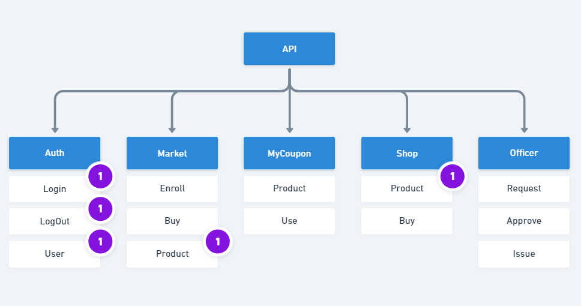
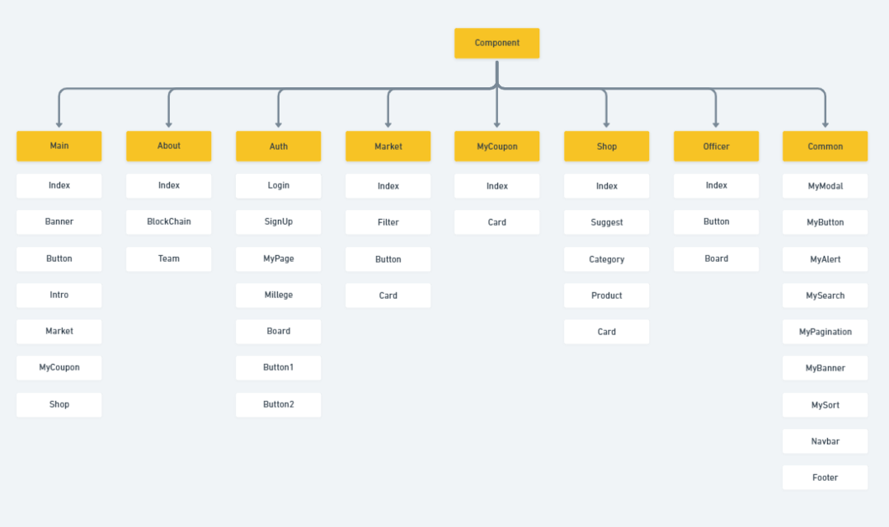
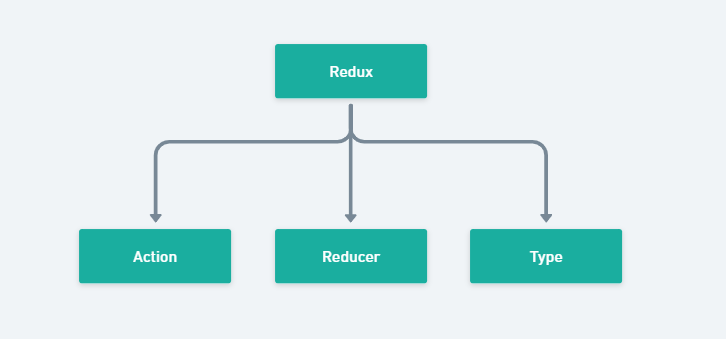

# SSACOIN

## 🔥 프로젝트 기간
2021년 8월 30일 ~ 2021 10월 8일

## 📓 프로젝트 설명
블록체인 스마트 컨트랙트 활용한 기프티콘 거래 플랫폼
```
블록체인 적용 부분

- 싸피 마일리지를 블록체인 기반 가상 화폐로 사용
- 스마트 컨트랙트로 안전한 기프티콘 구매
- 스마트 컨트랜트로 기프티콘 중고거래
```

### 사용자

- 사용하지 않거나 마감기간 안에 쓸 수 없는 기프티콘을 안전하게 거래하고 싶다면?
    
    → Market에서 P2P 중고거래
    
- 나의 마일리지로 내가 원하는 기프티콘을 사고 싶다면? → Shop에서 기프티콘 구매
- 나의 소중한 기프티콘을 안전하게 관리하고 싶다면? → MyCoupon에서 기프티콘 관리

### 관리자

- 기프티콘 승인 요청 처리와 승인 완료 관리를 한번에 !
- 사용자에게 마일리지 전송까지!

## 👩‍💻 제공 서비스

---

- 중고 거래 등록
- 중고 거래 구매
- 쿠폰샵에서 기프티콘 구매
- 마이 쿠폰 보관
- 나의 정보
- 관리자 구매 요청 관리
- 관리자 마일리지 전송

## 🛠️ 사용된 기술 스택 (프론트엔드)

---

- **React**
- Redux
- ESLint (Airbnb) + Prettier
- Javascript, HTML, SCSS
- Bootstrap

## 🛠️ 사용된 기술 스택 (백엔드)

---

- **Spring boot**
- [Spring Security](https://spring.io/projects/spring-security)
- JWT Token
- [Redis](https://redis.io/)
- JPA
- QueryDSL

## 🛠️ 사용된 기술 스택 (배포)

---

- 가상머신 - docker
- 블록체인  
    +  geth 
    +  [Web3j](https://docs.web3j.io/4.8.7/) : Java에서 블록체인 네트워크에 접속할 수 있는 라이브러리 
- CI/CD - Jenkins
- Database - MariaDB
- 웹 서버 - Nginx

### ESLint

---

`문법이나 코딩 스타일을 규정에 맞게 작성`될 수 있도록 도와주는 역할

- The pluggable lining utility for javaScript and JSX

[ESLint - Pluggable JavaScript linter](https://eslint.org/)

### Prettier

---

`코드 포맷터가 주관을 가지고 의도적으로 바꾸는` 역할

> 쓰는 이유는?
> 
- JSX 코드들을 작성하다보면 코드가 길어지기도 하는데, 코드를 잘라서 예쁘게 밑으로 내려주는 등의 수정을 해주어서 리액트 이후에 인기가 많아짐.
- An opinionated code formatter

[Prettier · Opinionated Code Formatter](https://prettier.io/)


## 🛠️ 협업툴

---

- Gitlab → 코드 형상 관리
- Notion → API 문서
- JIRA → 프로젝트 관리
- Slack & Metamost → 프로젝트 관련 파일
- Figma → 와이어 프레임
- Whimsical wireframe → 컴포넌트

## 메인 컬러

---

싸피 홈페이지([edu.ssafy.com](http://edu.ssafy.com/))를 바탕으로 메인 컬러 지정.

- Blue - 3396F4
- yellow - FFE651
- green - 9ADA94

## 와이어 프레임

---

> Figma - WireFrame


## 📚 React 파일구조

---

- 다양한 컴포넌트들을 만들어서 사용하는 React인 만큼, 개발 시작 전에 전체적인 구조를 잡고 개발 중 혼란이 없도록 하였습니다.
- 웹사이트의 통일성과 컴포넌트 재사용을 위해 Common 컴포넌트들을 미리 기획하고 한 폴더 내에서 관리 할 수 있도록 하였습니다.

> API
<center></center>

> Component
<center></center>

> Redux
<center></center>

```
    state를 이용해 웹 사이트 혹은 애플리케이션의 `상태 관리`를 해주는 역할

    LocalStorage와 SessionStorage의 storage를 redux에서 사용하게 해주는 `Redux-Persist 라이브러리` 추가
    해당 프로젝트에서는 로그인 여부와 사용자 정보를 관리해주고 있음.
```


## 📚 배포 구조

